# Riassunto finale: dalla formula del rischio ai DAG speculari

**Ultimo aggiornamento: 2026-07-16**

Questo documento riassume l'intero percorso sperimentale e ne motiva le
conclusioni, con i rimandi ai documenti e agli artefatti che le dimostrano.
Documenti collegati: [stato_e_visione.md](stato_e_visione.md) (stato e
roadmap), [risk_model.md](risk_model.md) (modello di rischio),
[workflow_esperimenti.md](workflow_esperimenti.md) (procedura operativa),
`CausalFlowDocker/ws/ANALISI.md` (inventario delle analisi).

---

## 1. Il problema

Obiettivo: due scenari HRI speculari (cambia solo il ruolo dei due agenti) che
producano **due DAG uno l'opposto dell'altro**, stabili rispetto a parametri
non strutturali (la velocità), da usare come ground truth per un **test
rapido di causal drift** (MMD sui residui di un predittore). Vincolo esterno:
`min_lag = max_lag = 1` nella causal discovery (F-PCMCI, TE + GPDC).

I DAG "storici" di maggio sembravano già perfetti:

| Scenario 1 (maggio) | Scenario 2 (maggio) |
|---|---|
| 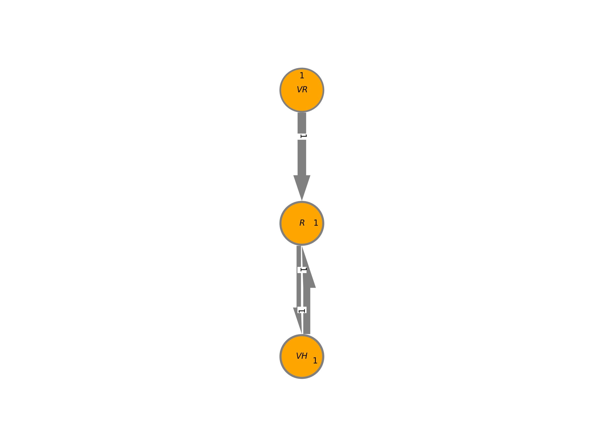 | 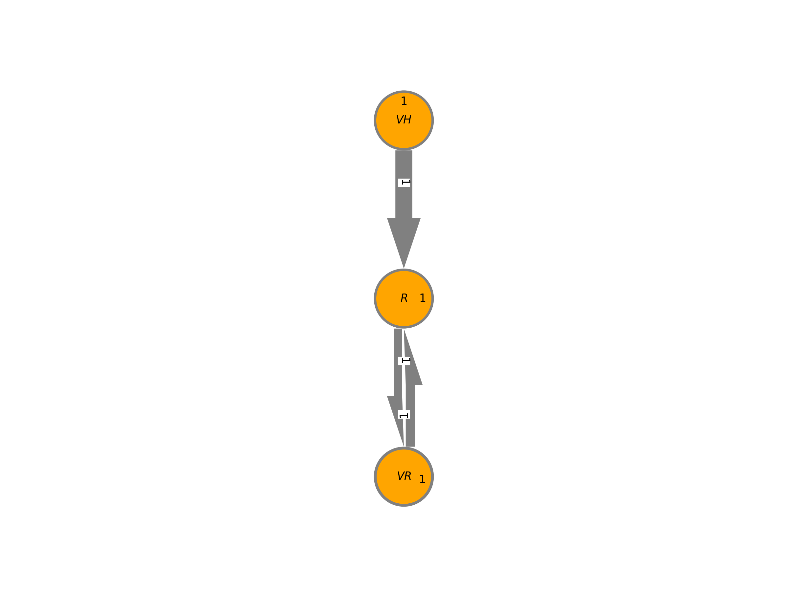 |

Ma non erano mai stati sottoposti al controllo di stabilità in velocità — ed
è proprio lì che il percorso è iniziato: il test di drift scattava anche tra
due run dello *stesso* scenario a velocità diverse.

## 2. Le tre formulazioni a confronto (stessa base dati)

Il confronto decisivo è stato fatto **a parità di dati**: quattro
registrazioni gemelle da 21 minuti (scenario × velocità {1.5, 2.0} m/s,
stesso codice, stesso protocollo — `shared/scenario_tesi_[1|2]_[1_5|2_0].bag`),
estratte con `extract_from_bag.py` / `extract_old_risk.py` (lettura diretta
del bag, niente replay). Criteri: (i) DAG identici tra le due velocità dello
stesso scenario; (ii) DAG speculari tra i due scenari; (iii) struttura
leggibile (catena mover → interazione → centro).

### 2.1 Formula storica: `risk = exp(1/L1 + bump di collisione)`

Ricostruita e validata contro il CSV di maggio (quantili coincidenti:
min 1.197 vs 1.198, q25 identico a 1.288 — vedi docstring di
`extract_old_risk.py`; la formula *committata* all'epoca, `exp(‖v_soggetto‖)`,
è esclusa dagli stessi numeri). Nota importante: `exp(1/L1)` è una trasformata
monotona della **distanza** — i DAG storici erano guidati dalla distanza già
allora.

| | @1.5 m/s | @2.0 m/s |
|---|---|---|
| **SC1** | 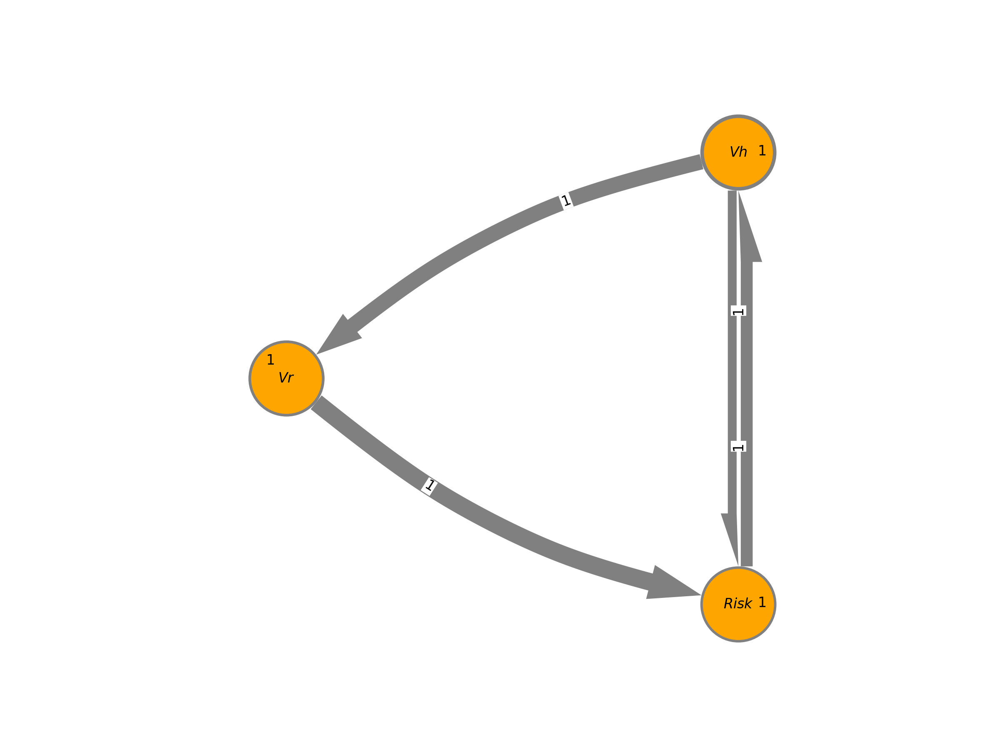 | 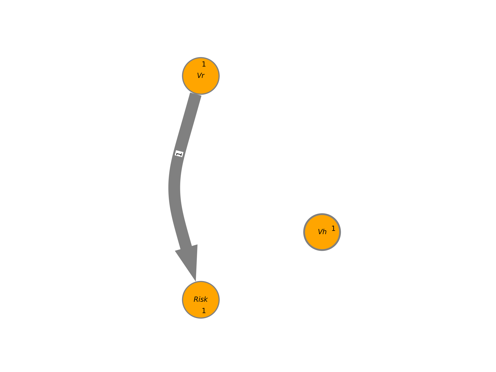 |
| **SC2** | 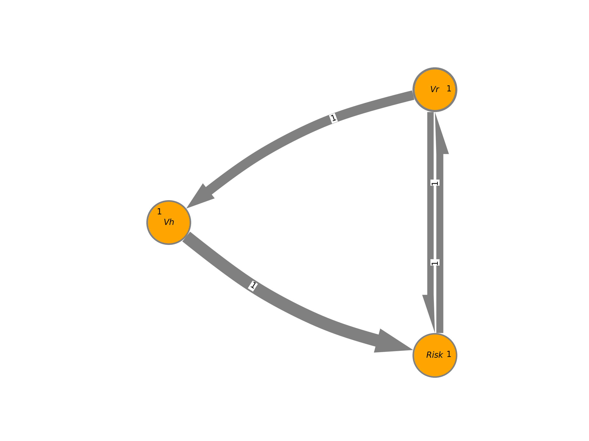 | 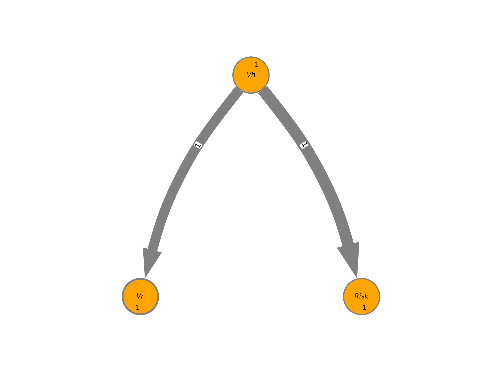 |

A 1.5 m/s riproduce (quasi) i DAG storici, speculari ma con un arco diretto
spurio tra le velocità. **A 2.0 m/s la struttura collassa**: in SC1 resta solo
`Vr→Risk` con `Vh` isolato, in SC2 sparisce la reazione. La formula storica
**fallisce il controllo di stabilità in velocità** — lo stesso controllo che
falliva il test di drift, e per la stessa ragione: la non-linearità `exp(1/·)`
comprime l'informazione in modo dipendente dal regime.

### 2.2 Formula nuova: `risk = 1 − exp(−(prossimità + 1/TTC))`

Corretta e difendibile come *metrica* (continua, limitata, ISO-15066-like:
[risk_model.md](risk_model.md) §4), ma per la *discovery* è dominata dalla
geometria latente: le velocità osservate pesano poco (`V→Risk` debole), i
clamp `max(0,·)` azzerano il gradiente in allontanamento, e con dati
sufficienti il grafo **satura in modo identico nei due scenari** (tutti gli
archi incrociati a p=0.000 — `ws/formula_sweep.py`), diventando cieco ai
ruoli. Esempio (run corte di luglio, dove l'instabilità produce archi diretti
spuri):

| SC1 @1.5 (formula nuova) | SC2 @1.5 (formula nuova) |
|---|---|
| 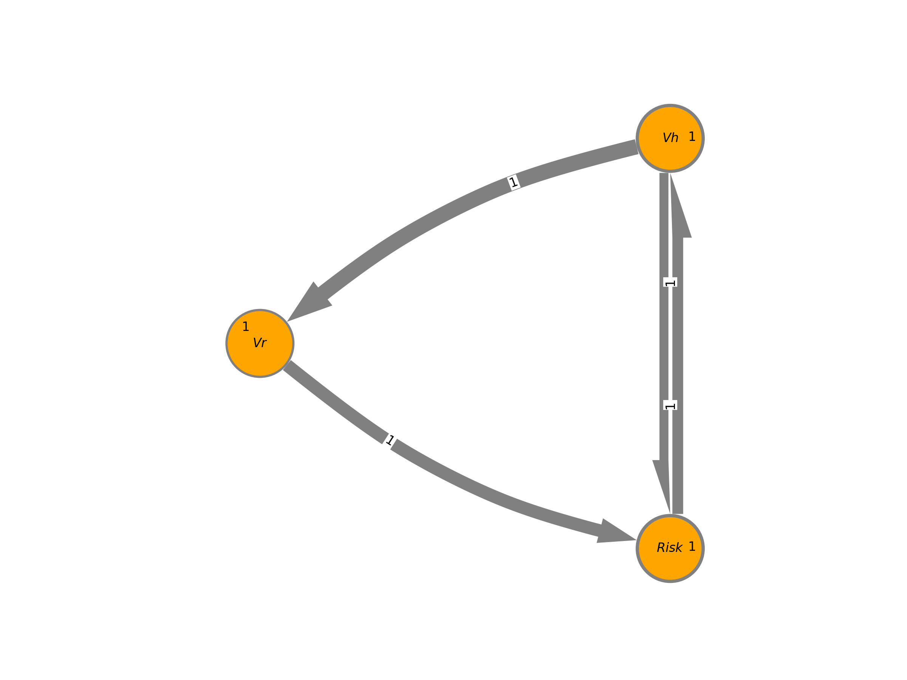 | 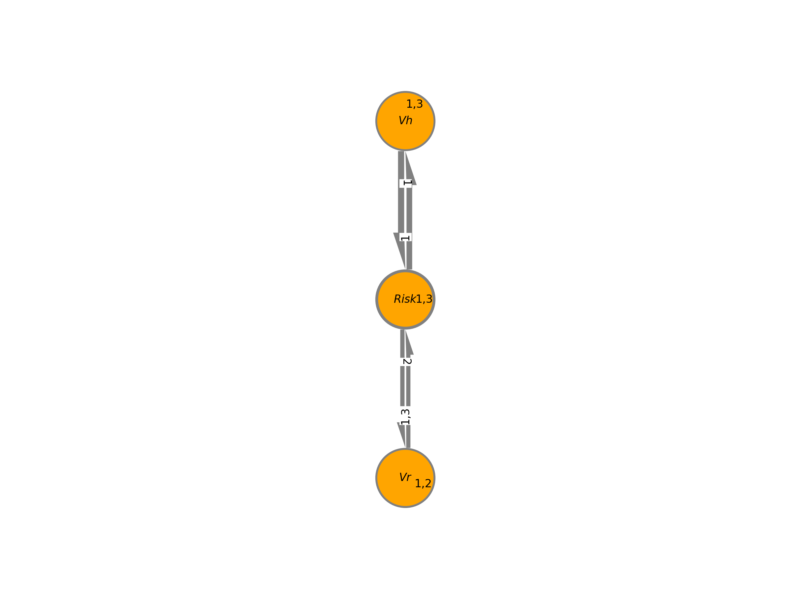 |

### 2.3 Distanza `D` come variabile di interazione

`V→D` è cinematica pura (la velocità muove la distanza anche se costante:
nessun problema di varianza della causa, niente eccitazione), accoppiamenti
~2× più forti di qualunque formula di rischio, nessun parametro da
giustificare. Risultato sulle 4 run gemelle (`ws/final_D_graphs.py`):

| | @1.5 m/s | @2.0 m/s |
|---|---|---|
| **SC1** | 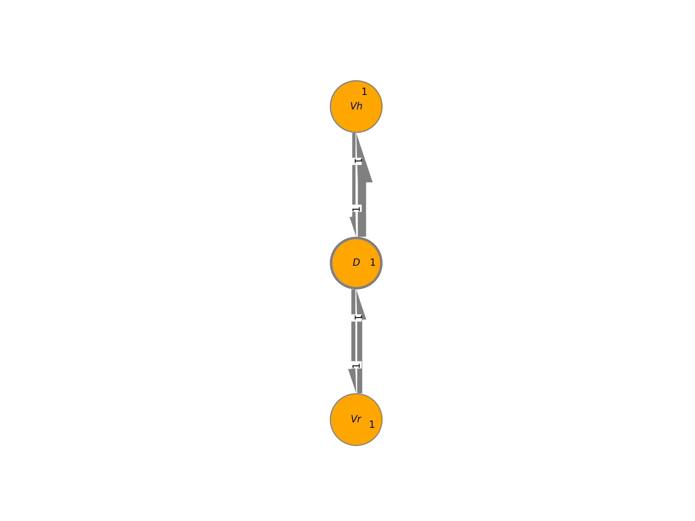 | 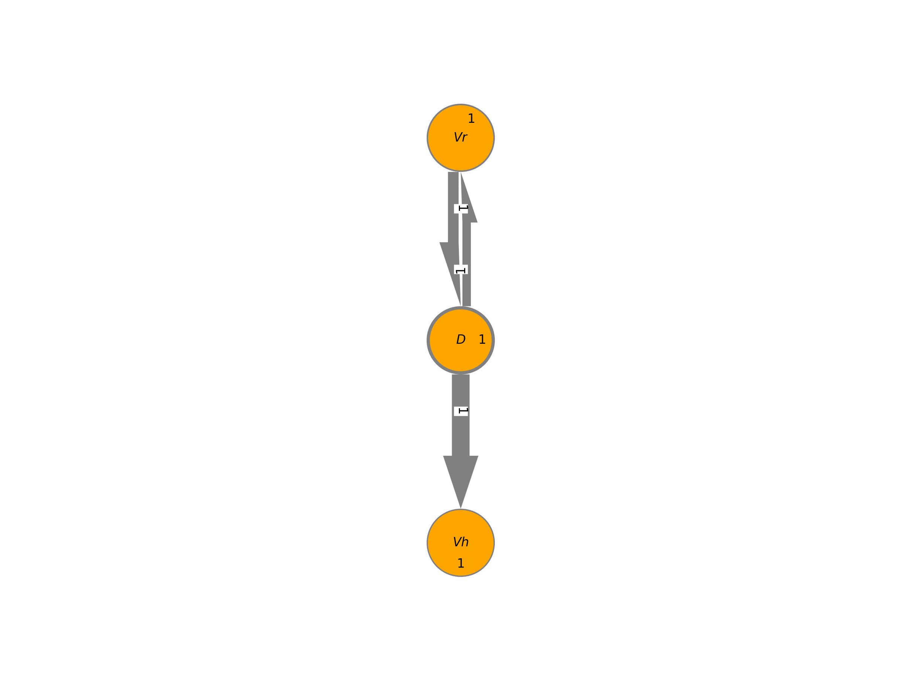 |
| **SC2** | 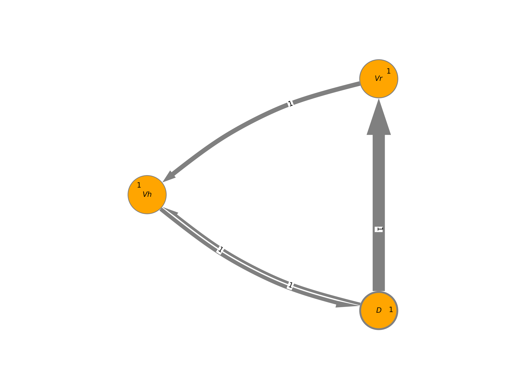 | 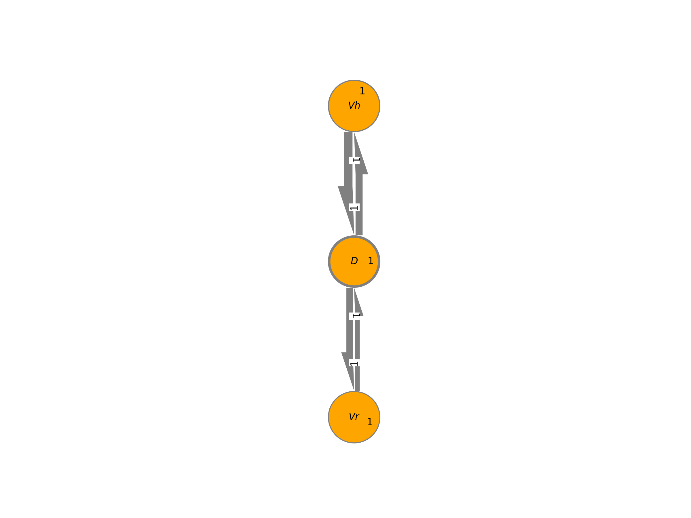 |

Nucleo replicato in **tutte e quattro** le run (p=0.000):

- **SC1: `Vr → D`, `D → Vh`, `D → Vr`**
- **SC2: `Vh → D`, `D → Vr`, `D → Vh`**

Speculare (scambia `Vr`↔`Vh` e coincidono), stabile tra le velocità, coi ruoli
leggibili: l'arco che entra in `D` viene dal mover; `D → V_centro` è la
reazione. Archi residui deboli e intermittenti: `V_centro → D` (il centro è
fermo ~66% del tempo) e un diretto marginale (p=0.036) in 1 run su 4.

### 2.4 Tabella riassuntiva

| Criterio | Storica `exp(1/L1+bump)` | Nuova `1−exp(−·)` | **Distanza `D`** |
|---|---|---|---|
| Specularità tra scenari | ✅ a 1.5, ❌ a 2.0 | ⚠️ banale (grafi saturi identici) | ✅ |
| Stabilità tra velocità | ❌ collasso a 2.0 | ✅ ma saturo | ✅ |
| Ruoli leggibili dalla struttura | parziale | ❌ | ✅ |
| Validità come metrica di rischio | ❌ (overflow, anisotropia L1, discontinuità) | ✅ | n/a (è una misura) |

## 3. Conclusioni

1. **Per la causal discovery la variabile giusta è la distanza `D`**, non una
   formula di rischio. Evidenza: matrice §2.4, p-value in
   `ws/ANALISI.md`, sweep in `ws/formula_sweep.py`. I DAG storici "belli"
   funzionavano *perché* la loro formula era una trasformata della distanza
   (validazione numerica in `extract_old_risk.py`), ma la trasformata
   `exp(1/·)` li rendeva fragili al regime di velocità.
2. **Per il test di drift la variabile giusta è `Risk` (formula nuova)**, con
   predittore e soglia calibrati su tutta la variabilità tollerata: così il
   test distingue cambio di struttura (MMD ≈ 0.069) da cambio di regime
   (≈ 0.004), separazione ~15× (`ws/drift_test.py`, design OLD vs FIXED).
   La formula storica non è utilizzabile qui (overflow e scala esplosiva,
   [risk_model.md](risk_model.md) §4.1).
3. **L'identificabilità è una proprietà del design sperimentale, non
   dell'algoritmo**: causa senza varianza = arco invisibile; mediatore non
   osservato = arco diretto spurio; variabile binaria in test per continue =
   grafo degradato. Le prove di ciascun punto sono negli esperimenti
   intermedi documentati in `ws/ANALISI.md` (eccitazione, concatenazione,
   colonna `Collision`).
4. **Vincolo `max_lag=1`**: gestito portando le scale temporali al passo del
   modello (decimazione ×4 tarata sulla latenza di reazione misurata; shift
   +1 solo per le variabili calcolate istantaneamente). Per `D` nessuno
   shift: la posizione integra le velocità.

## 4. Artefatti

| Cosa | Dove |
|---|---|
| Registrazioni gemelle definitive | `shared/scenario_tesi_[1\|2]_[1_5\|2_0].bag` |
| Estrattori diretti (nuova formula + `D` / storica) | `hrisim_analytics/scripts/extract_from_bag.py`, `extract_old_risk.py` |
| CSV | CausalFlowDocker `data/FormulaSweep/final_*.csv`, `data/oldRiskFormula/*.csv` |
| Discovery e figure | CausalFlowDocker `ws/final_D_graphs.py`, `ws/old_risk_dags.py`, PNG in `ws/` |
| Test di drift | CausalFlowDocker `ws/drift_test.py` |
